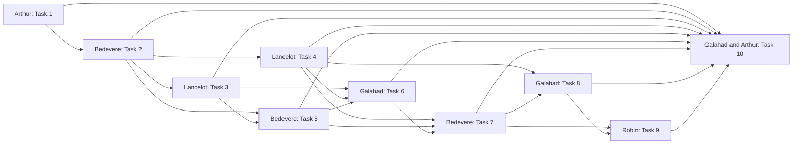

# OCI API MCP Wrapper — Approved A-Team Plan

**Status:** Approved and created
**Random theme:** Python Troupe, from Monty Python
**Authoritative plan:** `docs/superpowers/plans/2026-08-02-oci-api-mcp-wrapper.md`
**Project supervisor and authority:** Arthur

## Members and plan shares

### Arthur — Project Supervisor and Integration Authority

- Owns Task 1, the shared interface ledger, dependency sequencing, handoff
  reviews, approval routing, and final acceptance.
- Uses `gpt-5.6-sol` at maximum reasoning, with `gpt-5.6-terra` fallback.
- Initial instructions require Superpowers with the approved design, full plan,
  Task 1, dependency graph, and final acceptance criteria.
- All questions, blockers, conflicts, interface changes, and deviations route to
  Arthur. Arthur routes explicit approval gates to the user.

### Bedevere — Models, Catalog, Adapters, and MCP Surface Lead

- Owns Tasks 2, 5, and 7.
- Uses `gpt-5.6-sol` at high reasoning with pinned
  `gpt-5.3-codex-spark` for repetitive fixtures and mechanical contract work.
- Initial instructions require Superpowers with assigned tasks, dependencies,
  interfaces, and acceptance criteria, plus TDD and completion verification.
- May not add arbitrary shell execution, caller profile paths, unrestricted
  outbound HTTP, or a high-risk human-approval MCP tool.

### Galahad — Executor, Operations, and Acceptance Lead

- Owns Tasks 6, 8, and 10.
- Uses pinned `gpt-5.3-codex-spark` at high reasoning and escalates risky or
  ambiguous work to Arthur on `gpt-5.6-sol`.
- Initial instructions require Superpowers, TDD, systematic debugging, and
  verification against all dependency contracts and acceptance criteria.
- Must stop for separate user approval before live OCI mutations, package or
  shared-service actions, port reservation, and service activation.

### Lancelot — Security, Policy, State, and Audit Lead

- Owns Tasks 3 and 4 and security reviews for Tasks 6 through 10.
- Uses `gpt-5.6-sol` at maximum reasoning with an independent
  `gpt-5.6-terra` verification pass.
- Initial instructions require Superpowers with Task 2 interfaces, assigned
  tasks, downstream security gates, TDD, and systematic debugging.
- Incomplete metadata defaults to high risk. Lancelot cannot weaken authority
  separation, broaden destinations, expose credentials, or run live mutations.

### Robin — Documentation, Codex Integration, and Enablement Lead

- Owns Task 9 and documentation portions of every task.
- Uses pinned `gpt-5.3-codex-spark` at medium reasoning with
  `gpt-5.6-terra` escalation for durable integration decisions.
- Initial instructions require Superpowers plus `codex-scope-manager`,
  `skill-creator`, and Superpowers writing-skills before durable Codex changes.
- Owns public-safe documentation, plugin, skill, hooks, command validation, and
  reproducible handoff; unreviewed hooks may not be installed.

## Dependency graph

## Approval boundaries

- Team approval authorizes execution of the authoritative plan only.
- Every member must invoke Superpowers with its assigned share before acting.
- Live OCI mutations require separate explicit user approval.
- Port reservation, package installation, service activation, and hook
  installation remain coordinated execution-stage actions.
- Firewall, gateway, VPN, or remote exposure is outside scope and requires a
  separate high-risk approval workflow.
- Credentials, OCI profiles, authority secrets, runtime databases, audits,
  local logs, and personal exports must never enter Git.
