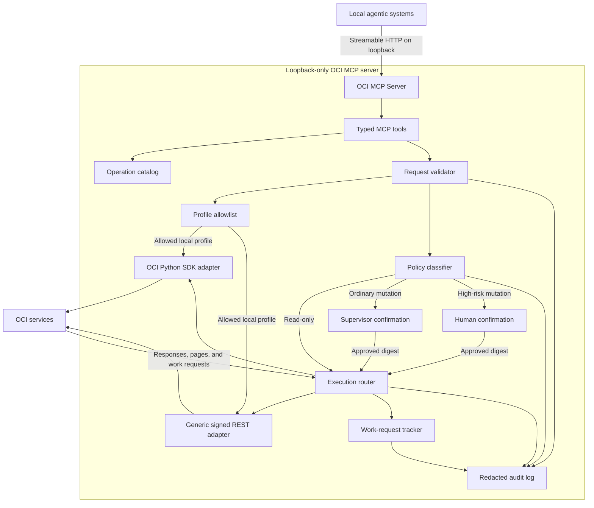

# OCI API MCP Wrapper Design

**Status:** Approved by the user
**Date:** 2026-08-02
**Source summary:** `docs/a-team-summary.md`

## Purpose

Build a loopback-only Model Context Protocol (MCP) server that enables local
agentic systems to use the complete Oracle Cloud Infrastructure (OCI) API. The
server supports reads, mutations, and destructive operations while enforcing
profile boundaries, input validation, tiered approval authority, secret
redaction, deterministic errors, and auditable execution.

Complete coverage means the generic execution path can address every documented
OCI HTTPS endpoint supported by the selected profile, realm, and region. It does
not mean every OCI operation will be executed during testing.

## Users and authority

- **Originating agent:** discovers and prepares OCI operations and receives
  results. It cannot silently approve its own mutation in the same request.
- **Trusted supervising agent:** may approve ordinary state-changing operations
  through a distinct authority credential and a separate prepare/execute flow.
- **Human supervisor:** must approve destructive, identity, security-sensitive,
  or potentially costly operations through a local command that displays the
  exact operation and digest.
- **Operator:** installs and configures the server, enables OCI profile aliases,
  manages authority credentials, reviews audits, and performs upgrades.

## Selected approach

Use a hybrid Python architecture:

- the official `mcp` Python SDK with `FastMCP`, stateless Streamable HTTP JSON
  responses, and a Starlette ASGI application served by Uvicorn;
- a small, stable set of typed MCP orchestration tools;
- OCI Python SDK adapters for operations represented by supported clients; and
- a validated signed REST adapter as the complete-coverage fallback.

This avoids an unmanageably large generated MCP tool catalog while giving
agents substantially better discovery, validation, and safety than a single
unstructured HTTP tool.

## Architecture

### Component boundaries

#### MCP transport

Expose Streamable HTTP on a loopback address only. Provide a separate health
endpoint that reports server, operation-catalog, runtime-store, and profile
alias readiness without contacting or revealing private keys.

#### Typed MCP surface

Keep the public tool surface compact and stable. It covers:

- service and operation discovery;
- safe profile-alias discovery;
- request preparation and risk explanation;
- read execution;
- mutation status, cancellation, and approved execution;
- work-request status and log retrieval;
- pagination continuation; and
- redacted audit lookup.

Tool names and exact schemas will be finalized in the implementation plan, but
the surface must not expose arbitrary shell execution, caller-supplied profile
paths, or unrestricted outbound HTTP.

#### Operation catalog

Build a normalized catalog from OCI SDK and CLI metadata plus documented
endpoint patterns. The catalog provides service, operation, method, path,
parameter, pagination, work-request, idempotency, and risk hints. Catalog data
assists discovery and validation; it must not restrict the generic adapter from
calling a newly documented OCI endpoint that passes endpoint policy.

#### Profile allowlist

The server may enumerate profile names but never return their contents. Local
configuration explicitly enables profile aliases and designates one default.
Requests may select only an enabled alias. Unknown aliases and caller-supplied
configuration paths fail closed. The server reads credentials directly from the
operator-configured OCI configuration and never persists credential material.

#### Request validation

Canonicalize and validate the selected profile alias, tenancy, region, realm,
endpoint, HTTP method, headers, query parameters, and body. Reject:

- endpoints outside recognized OCI domains and configured realm rules;
- redirects to unapproved hosts;
- unsafe or caller-controlled authorization and signing headers;
- local, private, link-local, metadata, or non-OCI destinations;
- malformed or oversized requests;
- credential-like fields that should not cross the MCP boundary; and
- unsupported payload types.

The implementation must handle DNS and redirect validation at connection time
so validation cannot be bypassed after an initial string check.

#### Policy classifier

Classify each canonical operation as:

- read-only;
- ordinary mutation; or
- destructive, identity-sensitive, security-sensitive, or potentially costly.

Conservative classification wins when metadata is incomplete or ambiguous.
Operators may strengthen classifications locally but cannot downgrade built-in
high-risk rules without an explicit configuration change and audit event.

#### Execution router

Prefer a typed OCI SDK client when the operation is supported and its behavior
matches the canonical request. Otherwise use the generic signed REST adapter.
Both adapters return the same structured result envelope and pass through the
same validation, approval, retry, redaction, and auditing boundaries.

#### Runtime state and audit

Store pending approvals, immutable request digests, execution state, and OCI
work-request references in an owner-only SQLite database in WAL mode outside
Git. Store audit events in append-only JSON Lines records linked by SHA-256
hashes so alteration or deletion is detectable. Neither store contains OCI
private keys, signing material, authorization headers, raw profiles, or
unredacted bodies by default.

## Request and confirmation flow

### Read-only operations

The agent discovers an operation or supplies a generic OCI request. The server
canonicalizes, validates, classifies, executes, redacts, audits, and returns the
result in one MCP call.

### Mutations

Mutations use separate preparation and execution phases:

1. The originating agent submits the intended operation.
2. The server canonicalizes all execution-relevant fields.
3. The server validates the request and assigns a risk class.
4. The server creates an immutable digest covering the profile alias, tenancy,
   region, realm, endpoint, method, safe headers, query, body, and policy class.
5. The server returns a pending request identifier, exact safe change summary,
   risk explanation, required authority, and expiry information.
6. An authorized supervisor approves an ordinary mutation, or a human approves
   a high-risk mutation with the local approval command.
7. The server revalidates the request, authority, policy, expiry, and digest.
8. The server executes the request once and consumes the approval.
9. The server audits and returns the structured result or a work-request handle.

Approvals are short-lived, single-use, bound to the exact digest, and unusable
after any request change. The originating client session cannot satisfy the
separate-authority requirement for its own mutation.

### Human approval interface

The high-risk approval action is not available to ordinary MCP clients. A local
command displays the profile alias, tenancy, region, operation, affected
resources, safe change summary, risk reasons, expiry, and digest. The human
confirms that exact record. The command does not display credentials or raw
secret-bearing fields.

### Long-running operations

Do not keep MCP calls open for the duration of OCI asynchronous work. Return a
stable local handle linked to the OCI work-request identifier. Status tools
retrieve state, sanitized errors, and log references. Completion and failure
transitions are audited.

## Results and errors

Use one result envelope across typed and generic execution paths. It includes:

- completion state;
- safe profile alias and region;
- OCI request identifier;
- sanitized response data;
- pagination continuation metadata;
- local and OCI work-request references;
- retryability and uncertainty flags; and
- safe next actions.

Use stable error categories for validation, policy denial, missing profile,
authentication, authorization, throttling, transient transport, OCI service,
approval, asynchronous work, and uncertain mutation outcome failures.

### Retry rules

- Retry safe reads with bounded backoff for explicitly retryable failures.
- Retry mutations only when OCI provides a suitable idempotency mechanism, the
  exact approved digest remains valid, and the retry cannot broaden effects.
- Never blindly repeat a mutation after connection loss or an ambiguous
  response.
- Mark ambiguous mutation results as `outcome_unknown` and reconcile through
  OCI lookup or explicit operator guidance before accepting another attempt.
- Return OCI request identifiers whenever available for diagnosis.

### Redaction rules

Redact credentials, signing keys, authorization headers, cookies, security
tokens, raw profiles, configured sensitive fields, and secret-bearing response
paths before data reaches logs, audits, errors, or MCP results. Redaction occurs
at multiple boundaries so adapter or exception behavior cannot bypass it.

## Security properties

- Bind only to loopback; do not expose a LAN, VPN, wildcard, or public listener.
- Accept only configured OCI profile aliases and approved authority credentials.
- Prevent generic requests from becoming an arbitrary network proxy.
- Separate originator, supervisor, and human approval authority.
- Bind approval to an immutable request digest and consume it once.
- Default ambiguous operations to the higher-risk class.
- Apply input and response size limits and bounded concurrency.
- Use owner-only permissions for local configuration, state, and audits.
- Never commit local OCI configuration, keys, authority credentials, runtime
  databases, audit records, or tenancy exports.
- Keep cost-sensitive and destructive live tests behind separate explicit user
  approval.

## Testing strategy

### Automated tests

- Unit tests for canonicalization, digests, profile allowlisting, endpoint
  validation, policy classification, authority checks, redaction, pagination,
  retries, work-request state, and audit integrity.
- Contract tests against OCI SDK metadata, CLI metadata, and documented endpoint
  patterns.
- MCP protocol tests for initialization, tool discovery, tool calls, sessions,
  concurrency, and structured errors.
- Security tests for endpoint escape, redirects, unsafe headers, profile-path
  injection, secret leakage, approval replay, digest mismatch, expired approval,
  authority bypass, oversized inputs, and malformed OCI responses.
- Simulated OCI tests for throttling, timeouts, ambiguous mutation outcomes,
  pagination, and asynchronous work failures.

### Live Free Tier tests

- Use a dedicated enabled profile and uniquely tagged test resources.
- Perform broad harmless reads across services available to the tenancy.
- Verify a representative generic signed request.
- Execute mutations only when they are explicitly approved and confirmed to be
  Free Tier-safe for the designated tenancy and region.
- Preflight quota, capacity, availability, and cost risk before mutation.
- Reconcile and verify cleanup for every created test resource.
- Test destructive, IAM, security-policy, and potentially billable paths through
  the approval boundary and mocked execution unless separately approved for a
  specific live test.

## Operations and packaging

- A `uv`-managed Python environment with a committed lockfile.
- The official `mcp` Python SDK, OCI Python SDK, Starlette, and Uvicorn as the
  core runtime stack.
- Pytest for tests, Ruff for formatting and linting, and mypy for static typing.
- Repeatable development, test, lint, type-check, and start commands.
- Loopback-only Streamable HTTP server and separate health endpoint.
- User-level service definition for reliable local operation.
- Local configuration template for profile aliases, authority policy, limits,
  state paths, audit retention, and catalog refresh behavior.
- Runtime state and audit paths outside the repository with owner-only access.
- Codex MCP registration and live initialize/list-tools/call-tool smoke tests.
- A reusable OCI MCP skill that routes OCI tasks to this server.
- Narrow readiness and evidence hooks packaged at the correct durable scope.
- Operator documentation covering installation, profiles, approvals, audits,
  troubleshooting, upgrade, catalog refresh, backup, and shutdown.

Any future protected-gateway, firewall, VPN, remote exposure, or shared-service
activation is outside this design and requires a separate explicit approval
workflow. The initial product remains loopback-only.

## Completion gates

- Formatting, linting, static typing, unit, contract, security, and MCP protocol
  tests pass.
- Live inspection confirms a loopback-only listener.
- Secret scanning finds no OCI credentials, local databases, audit logs, or
  private exports in tracked files.
- An enabled profile authenticates successfully and harmless tenancy, region,
  and compartment reads succeed.
- A representative generic signed OCI request succeeds.
- Approval replay, digest changes, expired approvals, and authority bypasses
  fail closed.
- Explicitly approved Free Tier-safe live mutations complete, reconcile, and
  clean up without unintended charges.
- Installation and verification are reproducible from a clean checkout using
  the documentation.

## Initial milestone

The first vertical slice will start the loopback MCP server, complete MCP
initialization and tool discovery, safely enumerate enabled profile aliases,
authenticate with a selected profile, perform harmless tenancy/region/
compartment reads, execute one generic signed read request, and prove that an
unconfirmed mutation is blocked and audited.

## Deferred decisions

Exact internal package names, focused file layout, MCP tool names and schemas,
catalog refresh commands, loopback port selection, user-service unit details,
and test command composition belong in the implementation plan. Those decisions
must preserve every boundary and acceptance condition in this design.
